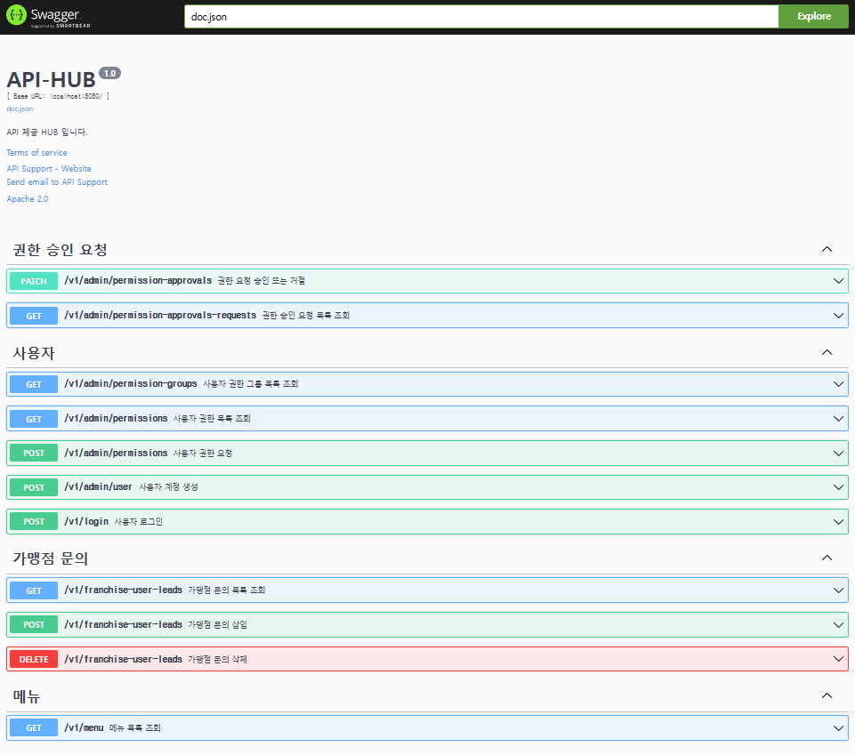
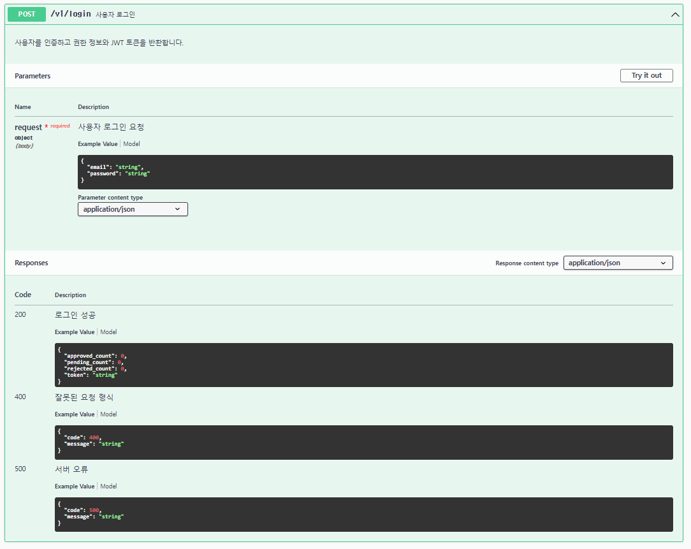
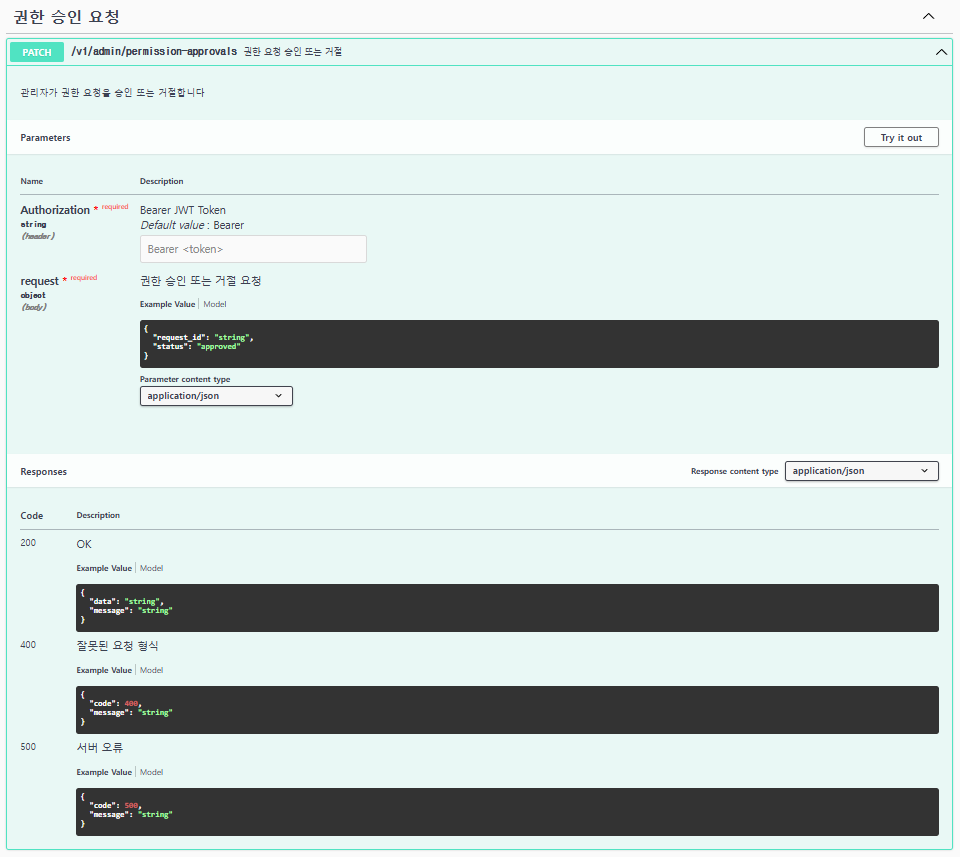

# 🛠️ Admin RESTful CRUD API

Go 언어 기반으로 개발된 관리자용 RESTful CRUD API 서비스입니다.  
Swagger 문서를 제공하여 API 테스트 및 연동이 용이합니다.

---

## 📌 프로젝트 소개

### 주요 기능
| 기능 | 설명 |
|---|---|
| 사용자 관리 | 사용자 계정 생성 |
| 권한 관리 | 사용자 권한 부여 |
| 데이터 CRUD | 리소스 생성(Create), 조회(Read), 수정(Update), 삭제(Delete) |
| 인증 및 인가 | JWT 기반 사용자 인증 및 권한 관리 |
| API 문서 제공 | Swagger UI를 활용한 API 문서 제공 |

---

## 🛠️ 기술 스택

| 구분 | 사용 기술 |
|---|---|
| Backend | Go (Golang), Gin |
| Database | MySQL |
| API 문서 | Swagger (swaggo/gin-swagger) |
| 인증 | JWT (jsonwebtoken) |

---

## 📂 프로젝트 폴더 구조

```text
restful-admin-crud/
│── config/          # 애플리케이션 환경 설정 (CORS, 설정 파일 등)
│── database/        # 데이터베이스 연결 및 마이그레이션 관련 코드
│── docs/            # API 문서 및 스웨거(Swagger) 문서화 관련 파일
│── handlers/        # HTTP 핸들러 (컨트롤러) 계층, 요청 처리 담당
│── middleware/      # 미들웨어 (인증)
│── models/          # 데이터 모델 정의
│── repositories/    # 데이터베이스 접근 레이어 (Repository 패턴 적용)
│── routes/          # 라우터 설정 (각 API 엔드포인트 정의)
│── services/        # 비즈니스 로직을 처리하는 서비스 계층
│── utils/           # 유틸리티 함수 및 공통 헬퍼 함수
│── .gitignore       # Git에 포함되지 않을 파일 정의
│── README.md        # 프로젝트 소개 및 설명 문서
│── go.mod           # Go 모듈 관리 파일
│── go.sum           # Go 의존성 관리 파일
│── main.go          # 애플리케이션 시작점 (Entry point)

```

---

## 📑 API 문서 (Swagger)

Swagger를 사용하여 API 테스트 및 문서를 제공합니다.

- **Swagger UI 접근 방법**
  ```bash
  http://localhost:8080/v1/swagger/index.html
  ```

Swagger 문서는 `swag init`을 통해 자동 생성할 수 있습니다.

- **Swagger 문서 생성**
  ```bash
  swag init
  ```

---

## RESTful API 상태 코드 (HTTP Status Codes)
아래는 주요 HTTP 상태 코드 및 설명입니다.

### 1xx: 정보 응답 (Informational Responses)

| 상태 코드 | 설명 |
|-----------|------------------------------------------|
| `100 Continue` | 요청이 정상적으로 접수되었으며 계속 진행 가능 |
| `101 Switching Protocols` | 클라이언트의 프로토콜 변경 요청을 수락함 |

### 2xx: 성공 (Success)

| 상태 코드 | 설명 |
|-----------|------------------------------------------|
| `200 OK` | 요청이 성공적으로 처리됨 (GET, PUT, DELETE 요청) |
| `201 Created` | 리소스가 성공적으로 생성됨 (POST 요청) |
| `204 No Content` | 요청이 성공했지만, 응답 본문이 없음 (DELETE 요청) |

### 3xx: 리디렉션 (Redirection)

| 상태 코드 | 설명 |
|-----------|------------------------------------------|
| `301 Moved Permanently` | 요청한 리소스가 영구적으로 이동됨 |
| `302 Found` | 요청한 리소스가 일시적으로 이동됨 |
| `304 Not Modified` | 캐시된 데이터를 사용할 수 있음 (클라이언트의 캐시 활용) |

### 4xx: 클라이언트 오류 (Client Errors)

| 상태 코드 | 설명 |
|-----------|------------------------------------------|
| `400 Bad Request` | 요청이 잘못되었거나 형식이 올바르지 않음 |
| `401 Unauthorized` | 인증이 필요함 (JWT 토큰 없음/만료됨) |
| `403 Forbidden` | 권한이 없어 요청을 수행할 수 없음 |
| `404 Not Found` | 요청한 리소스를 찾을 수 없음 |
| `405 Method Not Allowed` | 허용되지 않은 HTTP 메서드 사용 |

### 5xx: 서버 오류 (Server Errors)

| 상태 코드 | 설명 |
|-----------|------------------------------------------|
| `500 Internal Server Error` | 서버 내부 오류 (예상치 못한 에러) |
| `502 Bad Gateway` | 게이트웨이 서버가 잘못된 응답을 받음 |
| `503 Service Unavailable` | 서버가 현재 요청을 처리할 수 없음 (과부하 상태) |

---

## 📌 API 엔드포인트 목록

| HTTP Method | 엔드포인트 | 설명 |
|------------|-----------|-------------------------------|
| `PATCH` | `/v1/admin/permission-approvals` | 관리자가 권한 요청을 승인 또는 거절합니다. |
| `GET` | `/v1/admin/permission-approvals-requests` | 페이징을 지원하여 권한 요청 목록을 검색합니다. |
| `GET` | `/v1/admin/permission-groups` | 모든 사용자 권한 그룹을 검색합니다. |
| `GET` | `/v1/admin/permissions` | 모든 사용자 권한을 검색합니다. |
| `POST` | `/v1/admin/permissions` | 특정 계정에 대한 사용자 권한을 요청합니다. |
| `POST` | `/v1/admin/user` | 새로운 사용자 계정을 생성하고 JWT 토큰을 반환합니다. |
| `POST` | `/v1/login` | 사용자를 인증하고 권한 정보와 JWT 토큰을 반환합니다. |
| `GET` | `/v1/franchise-user-leads` | 페이징을 지원하여 가맹점 문의 목록을 검색합니다. |
| `POST` | `/v1/franchise-user-leads` | 새로운 가맹점 문의를 추가합니다. |
| `DELETE` | `/v1/franchise-user-leads` | 가맹점 문의 데이터를 삭제 상태로 업데이트합니다. |
| `GET` | `/v1/menu` | 사용자 권한 및 그룹 필터에 따라 메뉴 목록을 검색합니다. |

---

## 📸 기능 시연 이미지

### 1. Swagger API 문서
- Swagger UI에서 API 목록을 확인하고 테스트할 수 있습니다.


### 2. 사용자 생성 API
- `/v1/admin/user` 엔드포인트를 통해 새 사용자를 등록합니다.


### 3. 인증 (JWT 로그인)
- 로그인 후 발급된 JWT 토큰을 통해 API 요청을 수행할 수 있습니다.


### 4. 권한 승인 요청 API
- 로그인 후 계정에 권한 요청을 할 수 있습니다. 


### 4. 가맹점 문의 삭제 API
- 쓰기 권한이 부여된 계정으로 로그인 후 문의 내용을 삭제할 수 있습니다. 


---

## 📊 Database Table Structure

### 1. admin_users 테이블 (관리자 사이트 사용자 정보)

```sql
CREATE TABLE `admin_users` (
	`id` BIGINT(20) UNSIGNED NOT NULL AUTO_INCREMENT,
	`username` VARCHAR(50) NOT NULL,
	`email` VARCHAR(100) NOT NULL,
	`password` VARCHAR(255) NOT NULL,
	`role` VARCHAR(50) NULL DEFAULT 'admin',
	`is_active` TINYINT(1) NULL DEFAULT 1,
	`last_login` DATETIME NULL DEFAULT NULL,
	`created_at` DATETIME NULL DEFAULT current_timestamp(),
	`updated_at` DATETIME NULL DEFAULT current_timestamp() ON UPDATE current_timestamp(),
	PRIMARY KEY (`id`) USING BTREE,
	UNIQUE INDEX `email` (`email`) USING BTREE
);
```

### 2. admin_user_permissions 테이블 (사용자에게 부여된 권한 정보)

```sql
CREATE TABLE `admin_user_permissions` (
	`id` INT(11) NOT NULL AUTO_INCREMENT,
	`email` VARCHAR(100) NOT NULL COMMENT '사용자 ID',
	`permission_id` INT(11) NOT NULL COMMENT '권한 ID',
	`created_at` TIMESTAMP NULL DEFAULT current_timestamp(),
	`updated_at` TIMESTAMP NULL DEFAULT current_timestamp() ON UPDATE current_timestamp(),
	PRIMARY KEY (`id`) USING BTREE,
	INDEX `email` (`email`) USING BTREE,
	INDEX `permission_id` (`permission_id`) USING BTREE,
	CONSTRAINT `admin_user_permissions_ibfk_1` FOREIGN KEY (`email`) REFERENCES `admin_users` (`email`) ON UPDATE CASCADE ON DELETE CASCADE,
	CONSTRAINT `admin_user_permissions_ibfk_2` FOREIGN KEY (`permission_id`) REFERENCES `permissions` (`id`) ON UPDATE CASCADE ON DELETE CASCADE
);
```

### 3. admin_user_permission_requests 테이블 (사용자가 요청한 권한 정보)

```sql
CREATE TABLE `admin_user_permission_requests` (
	`id` INT(11) NOT NULL AUTO_INCREMENT,
	`email` VARCHAR(100) NOT NULL COMMENT '사용자 ID',
	`permission_id` INT(11) NOT NULL COMMENT '요청된 권한 ID',
	`status` ENUM('pending','approved','rejected') NOT NULL DEFAULT 'pending' COMMENT '요청 상태',
	`requested_at` TIMESTAMP NULL DEFAULT current_timestamp() COMMENT '요청 시간',
	`approved_at` TIMESTAMP NULL DEFAULT NULL COMMENT '승인 시간',
	`rejected_at` TIMESTAMP NULL DEFAULT NULL COMMENT '거절 시간',
	`admin_email` VARCHAR(100) NULL DEFAULT NULL COMMENT '승인/거절 처리한 관리자 ID',
	PRIMARY KEY (`id`) USING BTREE,
	INDEX `email` (`email`) USING BTREE,
	INDEX `permission_id` (`permission_id`) USING BTREE,
	CONSTRAINT `admin_permission_requests_ibfk_1` FOREIGN KEY (`email`) REFERENCES `admin_users` (`email`) ON UPDATE CASCADE ON DELETE CASCADE,
	CONSTRAINT `admin_permission_requests_ibfk_2` FOREIGN KEY (`permission_id`) REFERENCES `permissions` (`id`) ON UPDATE CASCADE ON DELETE CASCADE
);
```

### 4. permissions 테이블 (권한 목록 정보)

```sql
CREATE TABLE `permissions` (
	`id` INT(11) NOT NULL AUTO_INCREMENT,
	`name` VARCHAR(50) NOT NULL COMMENT '권한명',
	`type` VARCHAR(50) NULL DEFAULT 'url' COMMENT '권한 타입',
	`role` ENUM('read', 'write') NOT NULL DEFAULT 'read' COMMENT 'read/write',
	`detail` VARCHAR(100) NULL DEFAULT NULL COMMENT '상세 권한 설정',
	`description` TEXT NULL DEFAULT NULL,
	`sort` INT(11) NULL DEFAULT 0 COMMENT '권한 정렬 순서',
	`created_at` TIMESTAMP NULL DEFAULT current_timestamp(),
	`updated_at` TIMESTAMP NULL DEFAULT current_timestamp() ON UPDATE current_timestamp(),
	PRIMARY KEY (`id`) USING BTREE
);
```

### 5. permission_groups 테이블 (권한 목록을 그룹 단위로 묶은 정보)

```sql
CREATE TABLE `permission_groups` (
	`id` INT(11) NOT NULL AUTO_INCREMENT,
	`name` VARCHAR(50) NOT NULL,
	`description` TEXT NULL DEFAULT NULL,
	`sort` INT(11) NULL DEFAULT 0 COMMENT '권한 정렬 순서',
	`created_at` TIMESTAMP NULL DEFAULT current_timestamp(),
	`updated_at` TIMESTAMP NULL DEFAULT current_timestamp() ON UPDATE current_timestamp(),
	PRIMARY KEY (`id`) USING BTREE
);
```

### 6. menu 테이블 (메뉴 목록 정보)

```sql
CREATE TABLE `menu` (
	`id` INT(11) NOT NULL AUTO_INCREMENT,
	`group` VARCHAR(30) NOT NULL COMMENT '메뉴 그룹(관리자:admin)',
	`name` VARCHAR(255) NOT NULL COMMENT '메뉴명',
	`parent_id` INT(11) NULL DEFAULT NULL COMMENT '상위 메뉴 id (NULL 이면 1뎁스)',
	`url` VARCHAR(255) NULL DEFAULT NULL COMMENT '메뉴 URL 경로',
	`level` INT(11) NOT NULL DEFAULT 1 COMMENT '메뉴 레벨 (1, 2, 3)',
	`sort` INT(11) NULL DEFAULT 0 COMMENT '메뉴 정렬 순서',
	`is_active` TINYINT(1) NULL DEFAULT 1 COMMENT '활성화 여부 (1: 활성, 0: 비활성)',
	`created_at` TIMESTAMP NULL DEFAULT current_timestamp(),
	`updated_at` TIMESTAMP NULL DEFAULT current_timestamp() ON UPDATE current_timestamp(),
	PRIMARY KEY (`id`) USING BTREE,
	INDEX `parent_id` (`parent_id`) USING BTREE,
	CONSTRAINT `menu_ibfk_1` FOREIGN KEY (`parent_id`) REFERENCES `menu` (`id`) ON UPDATE RESTRICT ON DELETE CASCADE
);
```

### 7. franchise_user_leads 테이블 (외부 랜딩에서 유입된 데이터 정보)

```sql
CREATE TABLE `franchise_user_leads` (
	`id` INT(11) NOT NULL AUTO_INCREMENT,
	`name` VARCHAR(50) NULL DEFAULT NULL,
	`birth_date` DATE NULL DEFAULT NULL,
	`gender` ENUM('male', 'female', 'other') NULL DEFAULT NULL,
	`phone_number` VARCHAR(20) NULL DEFAULT NULL,
	`branch_location` VARCHAR(50) NULL DEFAULT NULL COMMENT '지점 위치',
	`inquiry` VARCHAR(255) NULL DEFAULT NULL COMMENT '문의내용',
	`status` ENUM('live','delete') NOT NULL DEFAULT 'live' COMMENT '요청 상태',
	`created_at` TIMESTAMP NOT NULL DEFAULT current_timestamp(),
	`delete_at` TIMESTAMP NULL DEFAULT NULL COMMENT '삭제 시간',
	`admin_email` VARCHAR(100) NULL DEFAULT NULL COMMENT '삭제 처리한 관리자 ID',
	PRIMARY KEY (`id`) USING BTREE,
	INDEX `idx_branch_location` (`branch_location`) USING BTREE
);
```

---

## 📦 설치 및 실행 방법

### 1. 클론 및 환경 설정
```bash
git clone https://github.com/aquaheyday/language-archive.git language-archive/go/projects/admin-restful-crud/
cd admin-restful-crud
```

### 2. 환경 변수 설정 (`.env`)
`.env` 파일을 생성하고 데이터베이스 및 JWT 설정을 입력합니다.

```env
DB_USERNAME=admin
DB_PASSWORD=secret
DB_HOST=localhost
DB_PORT=3306
DB_NAME=admin_db

JWT_SECRET=mysecretkey

CORS_ALLOWED_ORIGINS="http://localhost:*"
```

### 3. 애플리케이션 실행
```bash
go run main.go
```
