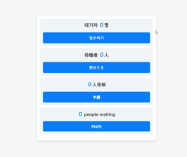

# 📥 queue-ticket

대기표 발급 및 호출 시스템 (Laravel 기반)

키오스크에서 대기표를 접수하고, 관리자가 고객번호를 호출하면 대기실 모니터 화면에 호출된 번호가 표시되는 시스템입니다.

---

## 📌 프로젝트 소개

### 주요 기능
| 기능 | 설명 |
|---|---|
| 로그인 | 부여된 계정 권한에 따라 페이지 노출 |
| 대기표 발급 | 키오스크에서 대기표 발급 및 접수 |
| 번호 호출 | 관리자가 관리 페이지에서 대기자 호출 |
| 실시간 모니터링 | 모니터 화면에서 현재 호출 번호 및 대기 번호 표시 |

---

## 🛠️ 기술 스택

| 구분 | 사용 기술 |
|---|---|
| Framework | Laravel 8.* |
| Frontend | Blade |
| Database | MySQL |
| 기타 | Docker (로컬 개발 환경 구성) |

---

## 📐 시스템 구성도
[키오스크] --> [서버 (Laravel)] --> [관리자 페이지] + [모니터 화면]

- 키오스크: 대기표 접수 화면
- 관리자: 대기번호 호출 및 현황 확인
- 모니터: 현재 호출 번호 확인 (풀스크린 디스플레이)

---

## 📲 기능 시연 이미지

|화면|설명|
|---|---|
| 로그인 | 부여된 권한별 화면 노출 |
| 키오스크 | 키오스크에서 터치로 대기번호 발급 |
| 관리자 호출 | 관리자가 대기번호 호출 |
| 모니터 | 모니터에서 현재 호출 번호 표시 |

### 1. 로그인 화면


### 2. 키오스크 화면


### 3. 관리자 호출 화면


### 4. 모니터 화면


---

## 📦 설치 및 실행 방법

### 1. 클론 및 환경 설정

```bash
git clone https://github.com/your-repo/queue-ticket.git
cd queue-ticket
cp .env.example .env
```
