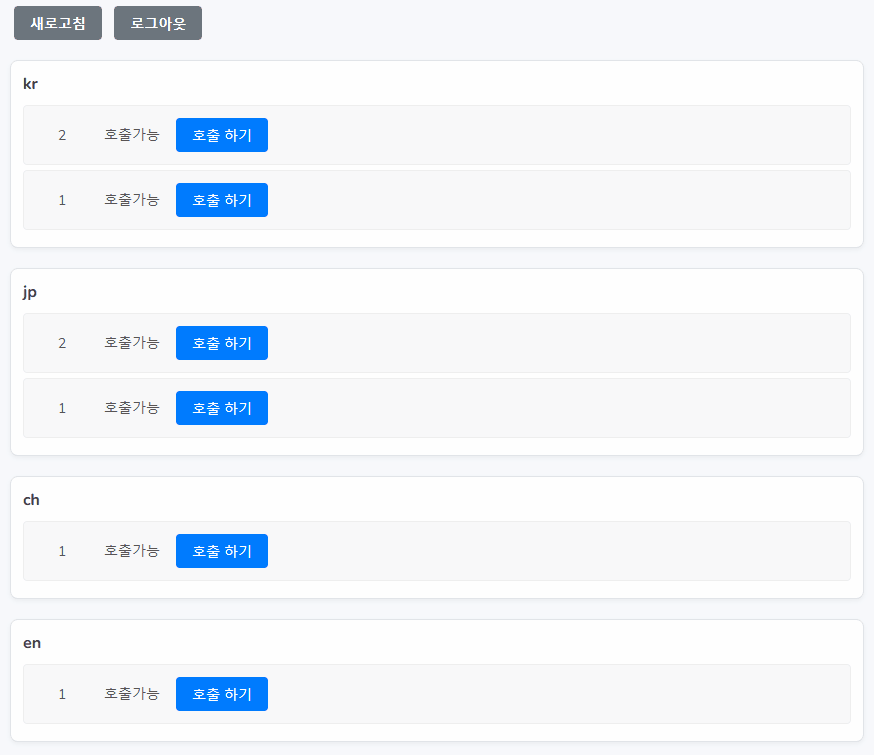
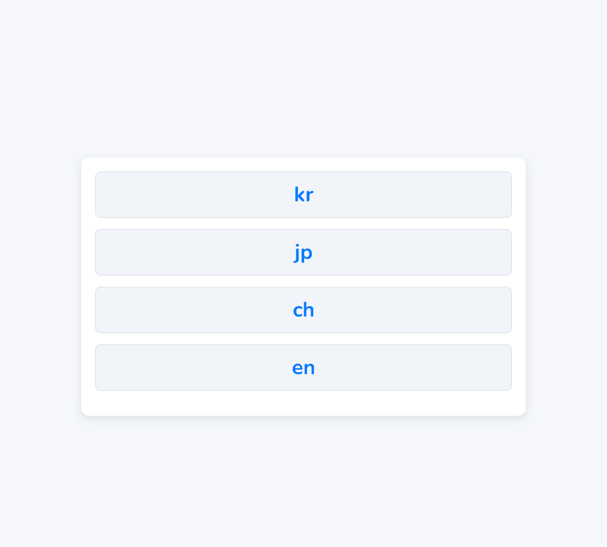

# 📥 queue-ticket

대기표 발급 및 호출 시스템 (Laravel 기반)

키오스크에서 대기표를 접수하고, 관리자가 고객번호를 호출하면 대기실 모니터 화면에 호출된 번호가 표시되는 시스템입니다.

---

## 📌 프로젝트 소개

### 주요 기능
| 기능 | 설명 |
|---|---|
| 로그인 | 부여된 계정 권한에 따라 페이지 노출 |
| 대기표 발급 | 키오스크에서 대기표 발급 및 접수 |
| 번호 호출 | 관리자가 관리 페이지에서 대기자 호출 |
| 실시간 모니터링 | 모니터 화면에서 현재 호출 번호 및 대기 번호 표시 |

---

## 🛠️ 기술 스택

| 구분 | 사용 기술 |
|---|---|
| Framework | Laravel 8.* |
| Frontend | Blade |
| Database | MySQL |
| 기타 | Docker (로컬 개발 환경 구성) |

---

## 📐 시스템 구성도
[키오스크] --> [서버 (Laravel)] --> [관리자 페이지] + [모니터 화면]

- 키오스크: 대기표 접수 화면
- 관리자: 대기번호 호출 및 현황 확인
- 모니터: 현재 호출 번호 확인 (풀스크린 디스플레이)

---

## 📊 Database Table Structure

### 1. P_MEMBER 테이블 (시스템 사용자 관리)

```sql
CREATE TABLE `P_MEMBER` (
    `SEQ` INT(11) NOT NULL AUTO_INCREMENT,
    `BRANCH` VARCHAR(50) NOT NULL COMMENT '지점정보',
    `ID` VARCHAR(100) NULL DEFAULT NULL COMMENT '사용자 ID',
    `PASSWORD` VARCHAR(100) NULL DEFAULT NULL COMMENT '비밀번호',
    `ACCOUNT_TYPE` VARCHAR(10) NULL DEFAULT '01' COMMENT '01:상담창구,02:키오스크,03:호출알림프론트',
    `NO` VARCHAR(10) NULL DEFAULT NULL COMMENT '자리번호 (상담창구용)',
    `REG_DATE` DATETIME NULL DEFAULT current_timestamp() COMMENT '등록일시',
    PRIMARY KEY (`SEQ`) USING BTREE,
    INDEX `BRANCH` (`BRANCH`) USING BTREE
);
```

### 2. P_NUMBER 테이블 (상담 대기번호 관리)

```sql
CREATE TABLE `P_NUMBER` (
    `SEQ` INT(11) NOT NULL AUTO_INCREMENT,
    `BRANCH` VARCHAR(50) NOT NULL COMMENT '지점정보',
    `COUNTRY` VARCHAR(10) NOT NULL COMMENT '국가정보',
    `NO` VARCHAR(50) NOT NULL COMMENT '상담번호',
    `STATUS` VARCHAR(10) NOT NULL DEFAULT '01' COMMENT '01:대기,02:진행중,03:완료',
    `COUNTRY_COUNSEL` VARCHAR(10) NULL DEFAULT NULL COMMENT '호출번호',
    `ADMIN_ID` VARCHAR(50) NULL DEFAULT NULL COMMENT '관리자 ID',
    `ADMIN_NO` VARCHAR(10) NULL DEFAULT NULL COMMENT '관리자 자리 번호',
    `DATE` DATE NULL DEFAULT NULL COMMENT '상담일',
    `END_TIME` TIME NULL DEFAULT NULL COMMENT '상담 완료 시간',
    `REG_DATE` DATETIME NULL DEFAULT current_timestamp() COMMENT '등록일시',
    `MOD_DATE` DATETIME NULL DEFAULT NULL COMMENT '수정일시',
    PRIMARY KEY (`SEQ`) USING BTREE
);
```

---

## 📲 기능 시연 이미지

|화면|설명|
|---|---|
| 로그인 | 부여된 권한별 화면 노출 |
| 키오스크 | 키오스크에서 터치로 대기번호 발급 |
| 관리자 호출 | 관리자가 대기번호 호출 |
| 모니터 | 모니터에서 현재 호출 번호 표시 |

### 1. 로그인 화면


### 2. 키오스크 화면


### 3. 관리자 호출 화면


### 4. 모니터 화면


---

## 📦 설치 및 실행 방법

### 1. 클론 및 환경 설정

```bash
git clone https://github.com/your-repo/queue-ticket.git
cd queue-ticket
cp .env.example .env
```

