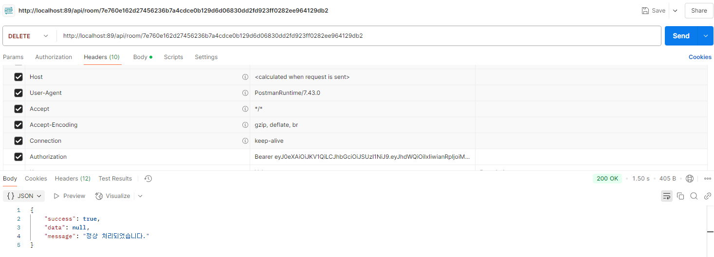
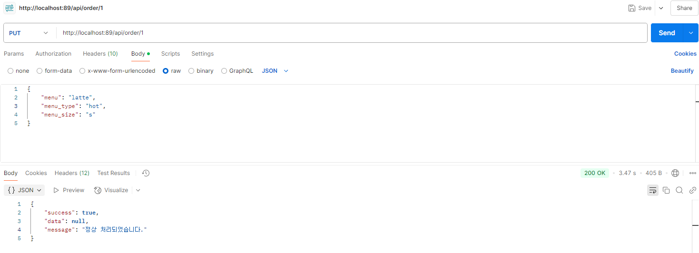

# 🍽️ Menu Order API

팀원들이 각자 메뉴를 접수하고, 랜덤으로 배달 담당을 선정하는 시스템입니다.  

---

## 📌 프로젝트 소개

### 주요 기능
| 기능 | 설명 |
|---|---|
| 로그인 | 팀별 계정으로 로그인 후 메뉴 접수방 생성 |
| 메뉴 접수방 생성 | 팀원들이 함께 참여할 접수방 생성 |
| 메뉴 접수 | 각자 원하는 메뉴 선택 및 접수 |
| 접수 마감 | 접수 종료 후 배달 담당 랜덤 선정 |
| 주문 내역 확인 | 모든 팀원이 접수 결과 확인 가능 |

---

## 🛠️ 기술 스택

| 구분 | 사용 기술 |
|---|---|
| Backend | Laravel 10 |
| Database | MySQL |
| 기타 | docker-compose로 컨테이너 관리 |

---

## 📲 기능 시연 이미지

### 1. [POST] 회원가입


### 2. [POST] 이메일 찾기


### 3. [POST] 비밀번호 찾기


### 4. [POST] 로그인


### 5. [GET] 방목록


### 6. [GET] 차트 정보


### 7. [GET] 방목록 탑 10


### 8. [POST] 방생성


### 9. [GET] 특정 방 조회


### 10. [PUT] 방 상태 변경


### 11. [DELETE] 방 삭제


### 12. [GET] 메뉴 등록 목록


### 13. [POST] 메뉴 등록


### 14. [PUT] 메뉴 수정


### 15. [DELETE] 메뉴 삭제


### 16. [GET] 사용자 정보


### 17. [PUT] 사용자 정보 변경


---

## 📦 설치 및 실행 방법

### 1. 클론 및 환경 설정

```bash
git clone https://github.com/aquaheyday/study-log.git study-log/projects/application/menu-order-api
cd menu-order-api
cp .env.example .env
```
