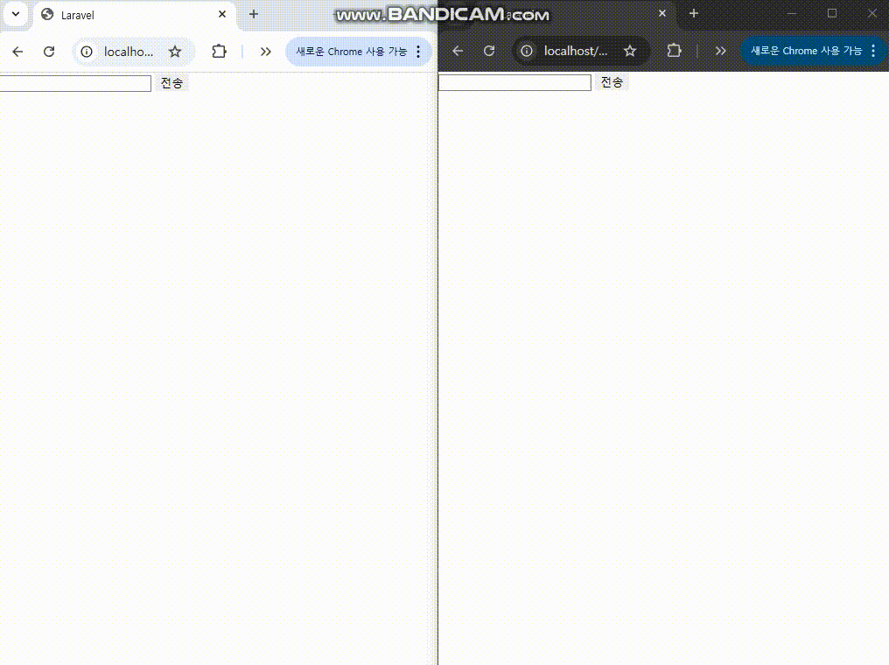
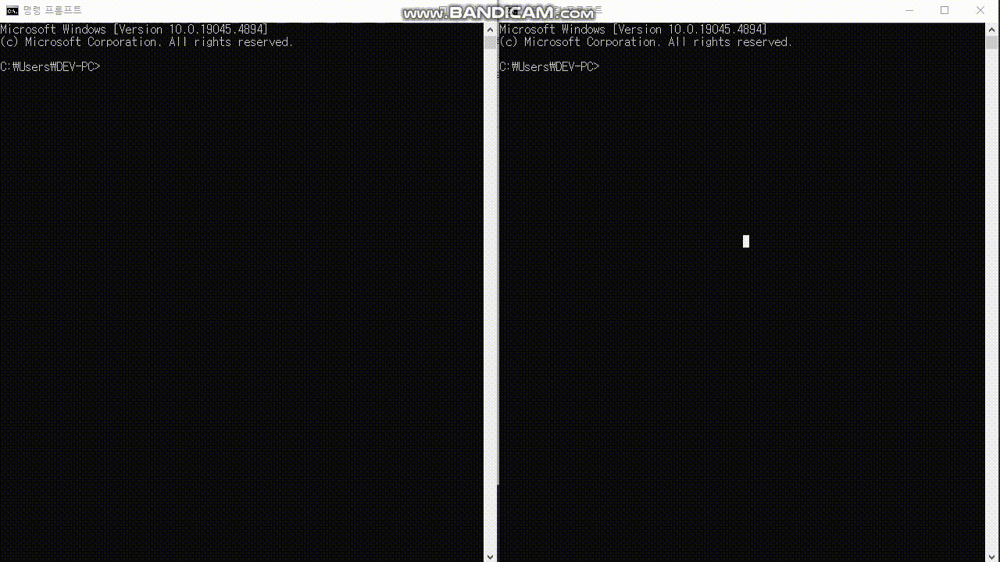

# Serverless WebSocket Chat with AWS Lambda, DynamoDB, API Gateway

**Lambda**, **DynamoDB**, **API Gateway(WebSocket)** 를 활용하여 서버리스 환경에서 실시간 채팅 시스템을 구축한 예제입니다.

---

## 🔧 주요 기능

- **Lambda Function**  
  서버리스 방식으로 실행되는 코드로, WebSocket 연결/해제 및 메시지 저장 등의 핵심 로직 수행

- **DynamoDB**  
  고속 읽기/쓰기 성능을 가진 NoSQL DB로 채팅 메시지와 커넥션 정보를 저장

- **API Gateway (WebSocket)**  
  사용자와 서버 간의 양방향 실시간 통신을 가능하게 함

---

## 🚀 구동 순서

1. **사용자가 WebSocket API에 접속**  
   클라이언트는 미리 정의된 WebSocket URL로 연결을 시도합니다.

2. **Lambda 함수가 DynamoDB에 연결 정보 저장**  
   `connect` 라우트를 통해 Lambda가 실행되며, 해당 사용자의 커넥션 ID를 DynamoDB에 저장합니다.

3. **사용자가 메시지 전송**  
   `message` 라우트를 통해 Lambda가 실행되어 전달받은 메시지를 DynamoDB에 저장합니다.

4. **연결된 사용자들에게 메시지 전송**  
   Lambda 함수가 현재 연결된 모든 사용자 커넥션을 조회하고, WebSocket을 통해 메시지를 브로드캐스팅합니다.

5. **사용자가 접속 종료**  
   `disconnect` 라우트를 통해 Lambda가 실행되며, 해당 커넥션 ID를 DynamoDB에서 삭제합니다.

---

## 📹 시연 영상

### Web Demo

### Cmd Demo

